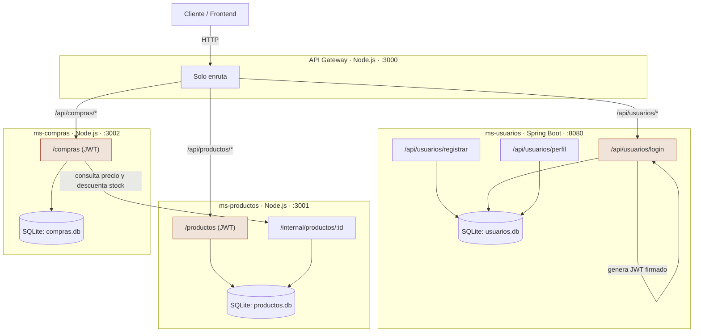

# Diagrama de arquitectura

**Llave compartida:** `ms-usuarios`, `ms-productos` y `ms-compras` usan la
misma `JWT_SECRET`. Por eso productos y compras pueden verificar el token
sin llamar de vuelta a usuarios.
                    
                         ┌─────────────┐
                         │  FRONTEND   │
                         └──────┬──────┘
                                │
                         JWT usuario
                                │
                                ▼
                       ┌────────────────┐
                       │  API GATEWAY   │
                       │    :3000       │
                       └───────┬────────┘
                               │
              ┌────────────────┼────────────────┐
              ▼                ▼                ▼
       ┌────────────┐   ┌────────────┐   ┌────────────┐
       │  USUARIOS  │   │ PRODUCTOS  │◄──│  COMPRAS   │
       │   :8080    │   │   :3001    │   │   :3002    │
       └─────┬──────┘   └─────┬──────┘   └─────┬──────┘
             │                │                │
             ▼                ▼                ▼
       usuarios.db      productos.db       compras.db

                         ▲
                         │
                  API INTERNA
                  protegida
                  servicio ↔ servicio

                  La arquitectura conceptual queda:

                 ┌──────────────────┐
                 │   ms-usuarios    │
                 │                  │
                 │ Login            │
                 │     ↓            │
                 │ Genera JWT       │
                 └────────┬─────────┘
                          │
                          │ JWT
                          ▼
                    ┌───────────┐
                    │ Frontend  │
                    └─────┬─────┘
                          │
                    Authorization
                       Bearer JWT
                          │
                          ▼
                   ┌─────────────┐
                   │ API Gateway │
                   └──────┬──────┘
                          │
             ┌────────────┼────────────┐
             ▼            ▼            ▼
       ms-usuarios  ms-productos  ms-compras
                         │             │
                         │             │
                     verifica      verifica
                       JWT            JWT